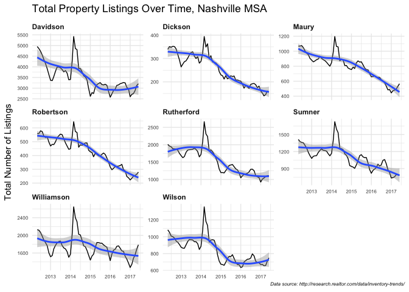
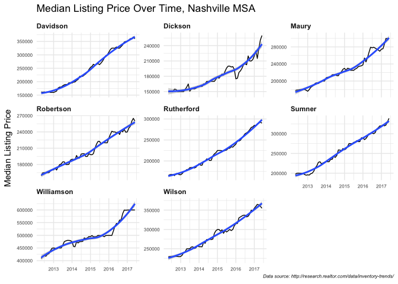

Realtor.com exploration
================

Source data: <http://research.realtor.com/data/inventory-trends/>, full historical county level

``` r
library(tidyverse)
```

    ## Loading tidyverse: ggplot2
    ## Loading tidyverse: tibble
    ## Loading tidyverse: tidyr
    ## Loading tidyverse: readr
    ## Loading tidyverse: purrr
    ## Loading tidyverse: dplyr

    ## Conflicts with tidy packages ----------------------------------------------

    ## filter(): dplyr, stats
    ## lag():    dplyr, stats

``` r
library(plotly)
```

    ## 
    ## Attaching package: 'plotly'

    ## The following object is masked from 'package:ggplot2':
    ## 
    ##     last_plot

    ## The following object is masked from 'package:stats':
    ## 
    ##     filter

    ## The following object is masked from 'package:graphics':
    ## 
    ##     layout

``` r
df <- read.csv(
  "RDC_InventoryCoreMetrics_County_Hist.csv",
  stringsAsFactors = FALSE
) %>%
  mutate(Month = as.Date(Month, format = "%Y-%m-%d")) %>%
  separate(CountyName, into = c("County", "State"), sep = ", *")
```

    ## Warning: Too few values at 1 locations: 62001

``` r
## Let's just look at Nashville/Murfreesboro/Franklin metro statistical area
## (Not all counties are included in data)
nash_msa <- c("Davidson", "Cannon", "Cheatham", "Dickson", "Hickman", "Macon",
              "Maury", "Robertson", "Rutherford", "Smith", "Sumner", "Trousdale",
              "Williamson", "Wilson")

df_nashmsa <- df %>%
  filter(State == "TN" & County %in% nash_msa)
```

Total Number of Listings
========================

``` r
num_listings <- ggplot(data = df_nashmsa,
                       aes(x = Month, y = Total.Listing.Count)) +
  facet_wrap(~ County, scales = "free_y") +
  geom_line() +
  geom_smooth() +
  scale_y_continuous(name = "Total Number of Listings") +
  theme_minimal() +
  theme(axis.title.x = element_blank(),
        axis.text = element_text(size = 6),
        plot.caption = element_text(face = "italic", size = 6),
        strip.text = element_text(hjust = 0, face = "bold")) +
  labs(title = "Total Property Listings Over Time, Nashville MSA",
       caption = "Data source: http://research.realtor.com/data/inventory-trends/")

num_listings
```

    ## `geom_smooth()` using method = 'loess'



``` r
# num_listings %>% ggplotly(width = 1000, height = 600)
```

Median Listing Price
====================

``` r
median_price <- ggplot(data = df_nashmsa,
                       aes(x = Month, y = Median.Listing.Price)) +
  facet_wrap(~ County, scales = "free_y") +
  geom_line() +
  geom_smooth() +
  scale_y_continuous(name = "Median Listing Price") +
  theme_minimal() +
  theme(axis.title.x = element_blank(),
        axis.text = element_text(size = 6),
        plot.caption = element_text(face = "italic", size = 6),
        strip.text = element_text(hjust = 0, face = "bold")) +
  labs(title = "Median Listing Price Over Time, Nashville MSA",
       caption = "Data source: http://research.realtor.com/data/inventory-trends/")

median_price
```

    ## `geom_smooth()` using method = 'loess'



``` r
# median_price %>% ggplotly(width = 1000, height = 600)
```

Really surprised at median home price in Davidson - I thought it was lower, per [news reports](http://nashvillepublicradio.org/post/nashville-home-sales-market-still-hot-hot-hot#stream/0), but at a closer look it seems like news may be reporting entire MSA. Check you out, Williamson County.
